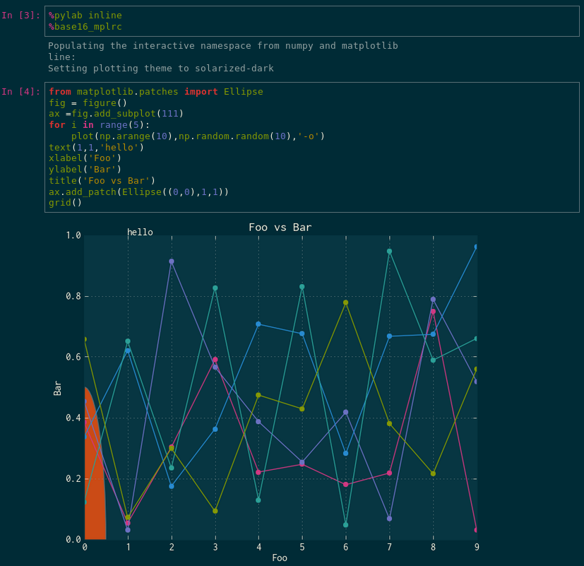
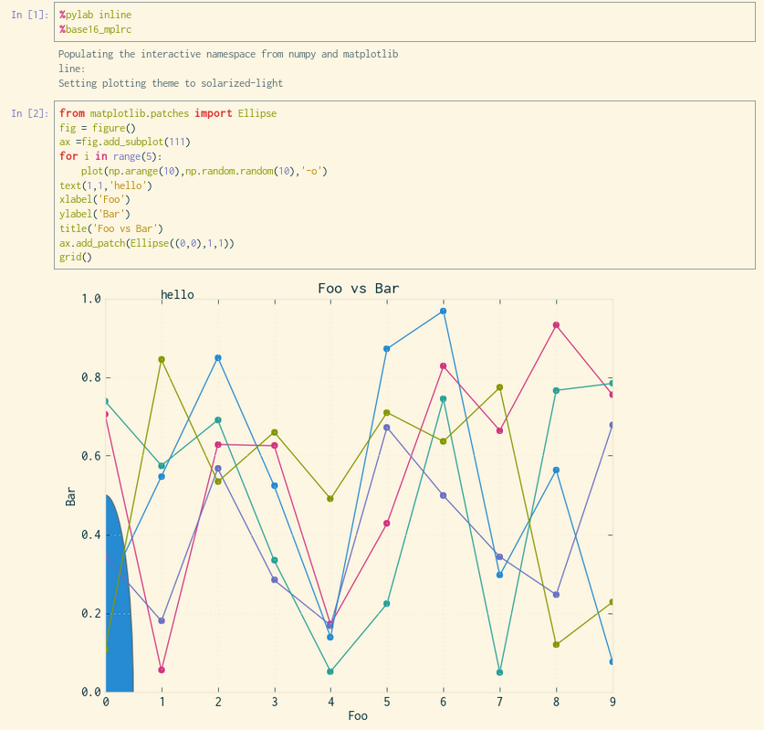
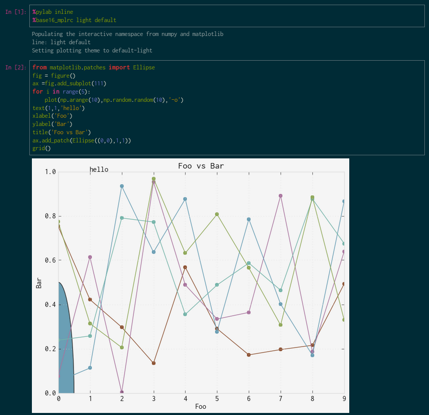

# Base 16 for IPython Notebook

An ipython extension to load custom matplotlibrcs to accompany Nikhil Sonnad's [style sheets][0] for [IPython Notebook][1], using Chris Kempson's [Base16][2] color scheme generator 

## Screenshots

####Solarized Dark with Solarized Dark notebook


####Solarized Light with Solarized Light notebook


####Default Light  with Solarized Dark notebook



## Installation

To use these color schemes, you'll install this extension in the extensions folder of your ipython. You can find where your ipython directory is, run
`ipython locate`

You can copy the contents of this directory into your `extensions` directory in your base ipython directory. Once loaded, this extension can be loaded as any other ipython extension

```
cp -r base16* ~/.ipython/extensions/.
```

Using the `%load_ext` magic:

```
In [1]: %load_ext base16_mplrc
```

or by modifying your `ipython_notebook_config.py` in your profile directory

``c.InteractiveShellApp.extensions = [
    'base16_mplrc'
     ]``

If you don't have a custom profile, run:

`ipython profile create <profile-name>`

To locate the directory of your profile, do:

`ipython locate profile <profile-name>`


once loaded, you can invoke it via line magic

```
In [1]: %base16_mplrc <shade> <theme>
        %pylab inline
```

`shade` and `theme` are both optional positional arguments. If both are absent, then this extension
attempts to find the one matching the base16 theme you have installed in profile directory's `static/custom/custom.css`.

```
Type:       Magic function
String Form:<bound method MPLRCMagics.base16_mplrc of <base16_mplrc_dark.MPLRCMagics object at 0x2a17050>>
Namespace:  IPython internal
File:       /home/benjib0t/.ipython/extensions/base16_mplrc_dark.py
Definition: %base16_mplrc(self, args)
Docstring:
::

  %base16_mplrc [shade] [theme]

  positional arguments:
    shade  shade of theme, light or dark
    theme  base16 theme
```


This extension will only modify the colors of your matplotlibrc for the use in the ipython notebooks; it will respect any other settings in your default matplotlibrc

## Custom fonts
You can set the default fonts by modifying your `ipython_notebook_config.py`:

```
c.InlineBackend.rc = {'font.family':'Inconsolata'}
```
## Credits

* Uses Base16 builder by [Chris Kempson][3]. 
* Based off of base16-ipython-notebook by [Nikhil Sonnad][0]. 

[0]: https://github.com/nsonnad/base16-ipython-notebook
[1]: http://ipython.org/notebook.html
[2]: https://github.com/chriskempson/base16
[3]: https://github.com/chriskempson
[4]: https://github.com/idleberg/base16-codemirror
[5]: https://github.com/idleberg
