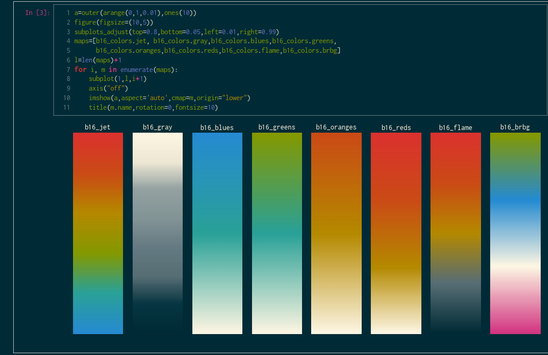

# Base 16 Inline Backend Themes for IPython Notebook

An ipython extension to load custom matplotlibrcs to accompany Nikhil Sonnad's [style sheets][0] for [IPython Notebook][1], using Chris Kempson's [Base16][2] color scheme generator 

*There is a bug in IPython2.0 that results in the figure backgrounds always being white. I've submitted a pull request [here](https://github.com/ipython/ipython/pull/5756). Not sure when it will be merged.*

## Screenshots

####Eighties Dark with Eighties Dark notebook


####Solarized Dark with Solarized Dark notebook



####Default Light  with Solarized Dark notebook


## Installation

To use these color schemes, you'll install this extension in the extensions folder of your ipython. You can find where your ipython directory is, run
`ipython locate`

You can copy the contents of this directory into your `extensions` directory in your base ipython directory.

```
cp -r base16* ~/.ipython/extensions/.
```

Once installed, this extension can be loaded as any other ipython extension

Using the `%load_ext` magic:

```
In [1]: %load_ext base16_mplrc
```

or by modifying  `ipython_notebook_config.py` in your profile directory

``c.InteractiveShellApp.extensions = [
    'base16_mplrc'
     ]``

If you don't have a custom profile, run:

`ipython profile create <profile-name>`

To locate the directory of your profile, do:

`ipython locate profile <profile-name>`


once loaded, you can invoke it via line magic

```
In [1]: %base16_mplrc <shade> <theme>
        %pylab inline
```

`shade` and `theme` are both optional positional arguments. If both are absent, then this extension
attempts to find the one matching the base16 theme you have installed in profile directory's `static/custom/custom.css`.

```
Type:       Magic function
String Form:<bound method MPLRCMagics.base16_mplrc of <base16_mplrc_dark.MPLRCMagics object at 0x2a17050>>
Namespace:  IPython internal
File:       /home/benjib0t/.ipython/extensions/base16_mplrc.py
Definition: %base16_mplrc(self, args)
Docstring:
::

  %base16_mplrc [shade] [theme]

  positional arguments:
    shade  shade of theme, light or dark
    theme  base16 theme
```


This extension will only modify the colors of your matplotlibrc for the use in the ipython notebooks; it will respect any other settings in your default matplotlibrc

It also pushes an object `b16_colors` to your shell, which contains colors and colormaps.

```
#colors
b16_colors.r = b16_colors.red
b16_colors.o = b16_colors.orange
b16_colors.y = b16_colors.yellow
b16_colors.g = b16_colors.green
b16_colors.c = b16_colors.cyan
b16_colors.b = b16_colors.blue
b16_colors.m = b16_colors.magenta
b16_colors.n = b16_colors.brown
b16_colors.w = b16_colors.white
b16_colors.k = b16_colors.black

#colormaps
b16_colors.jet registered as 'b16_jet'
b16_colors.gray registered as 'b16_gray'
b16_colors.blues registered as 'b16_blues'
b16_colors.greens registered as 'b16_greens'
b16_colors.reds registered as 'b16_reds'
b16_colors.oranges registered as 'b16_oranges'
b16_colors.flame registered as 'b16_flame'
b16_colors.brbg registered as 'b16_brbg'
```

## Custom fonts
You can set the default fonts by modifying your `ipython_notebook_config.py`:

```
c.InlineBackend.rc = {'font.family':'Inconsolata'}
```
## Credits

* Uses Base16 builder by [Chris Kempson][3]. 
* Based off of base16-ipython-notebook by [Nikhil Sonnad][0]. 

[0]: https://github.com/nsonnad/base16-ipython-notebook
[1]: http://ipython.org/notebook.html
[2]: https://github.com/chriskempson/base16
[3]: https://github.com/chriskempson
[4]: https://github.com/idleberg/base16-codemirror
[5]: https://github.com/idleberg
